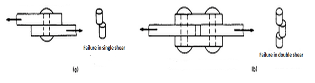
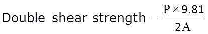
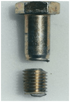
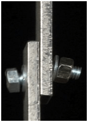
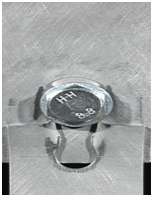

Shear stress exists when two parts of a material tend to slide across each other in any typical plane of shear upon application of force parallel to that plane. In actual practice when a beam is loaded the shear force at a section always comes to play along with bending moment.The effect of shearing stresses is quite negligible compared to bending stress. But sometimes, the shearing stress at any section is to be given much importance in design calculations. Shear test is performed by using universal testing machine.

There are two types of universal testing machines i.e., 1. Screw type 2. Hydraulic type. Hydraulic machines are easier to operate.They have a testing unit and control unit connected to each other with hydraulic pipes. It has a reservoir of oil, which is pumped into a cylinder and has a piston. By this arrangement the piston is made to move up. Same oil is taken in a tube to measure the pressure. This causes movement of the pointer which gives reading for the load applied.

The test is conducted by placing the shear test attachment on the lower table, this attachment consist of a cutter. The load is applied such that the specimen breaks in two or three pieces. If the specimen breaks in two pieces then it will be in single shear & if it breaks in three pieces then it will be in double shear. If there is only one cross section which resist the failure, the material is said to be in single shear and the average ultimate strength in single shear will be equal to the failure load divided by the area of cross section.

According to the standards the speed of testing or the rate of separation of the cross-heads at any moment during the test shall not be greater than 10 mm/min. The maximum load divided by the combined cross-sectional area of the two planes gives the double shear strength. This shall be calculated from the following formula

**Practical cases of shear failure**:

Source: [https://expeditionworkshed.org/workshed/bolted-steel-connection-failure-plate-tearing/](https://expeditionworkshed.org/workshed/bolted-steel-connection-failure-plate-tearing/)

**RELEVANT INDIAN STANDARD FOR DIRECT SHEAR TEST**:

1. IS 5242-1979: Method of test for determining shear strength of metals.
